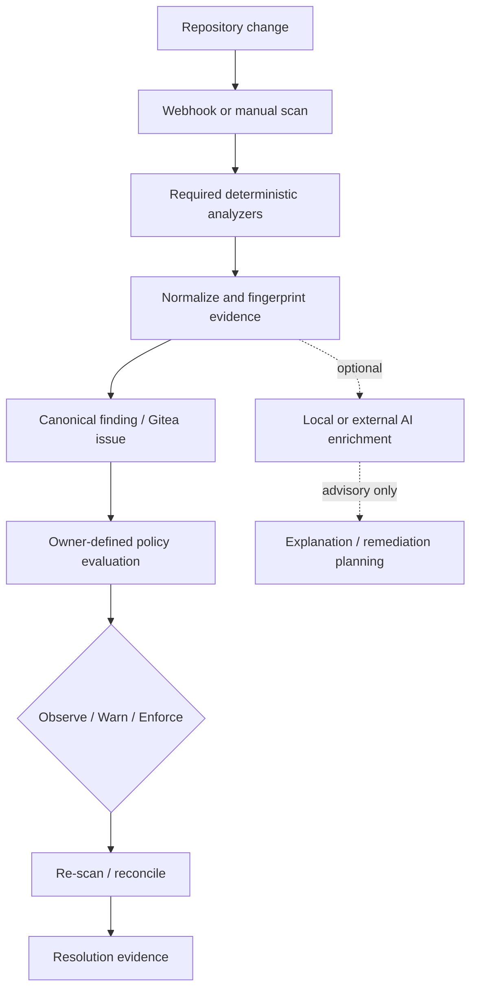
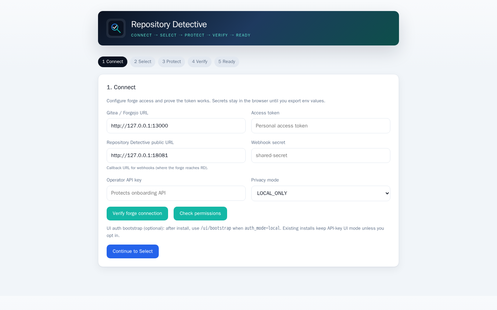
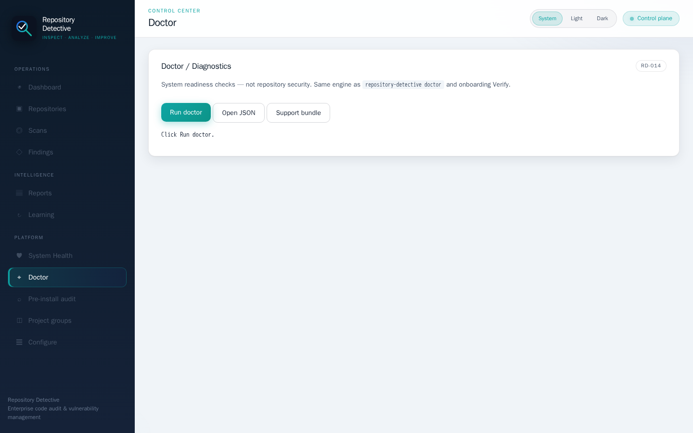
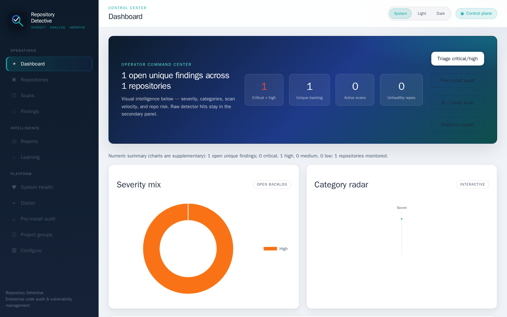
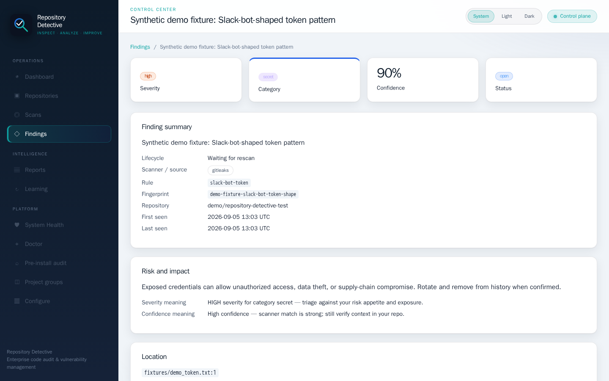
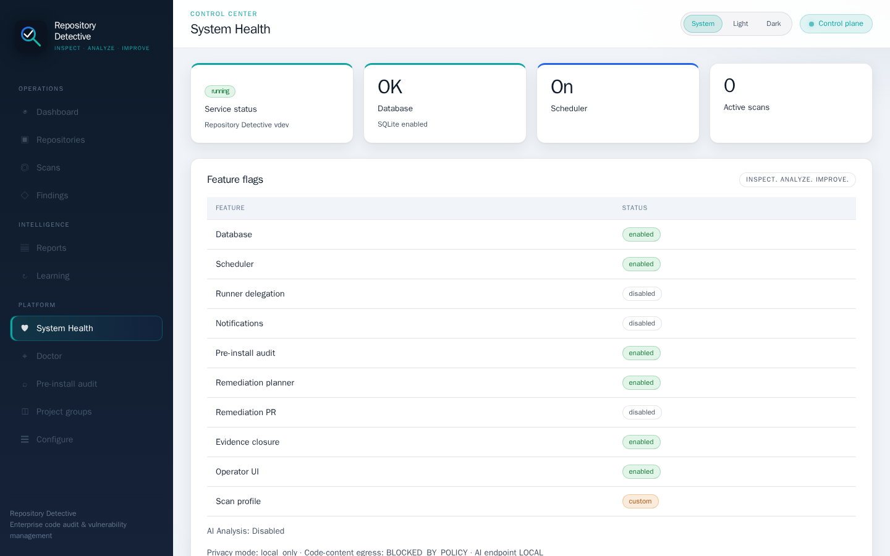
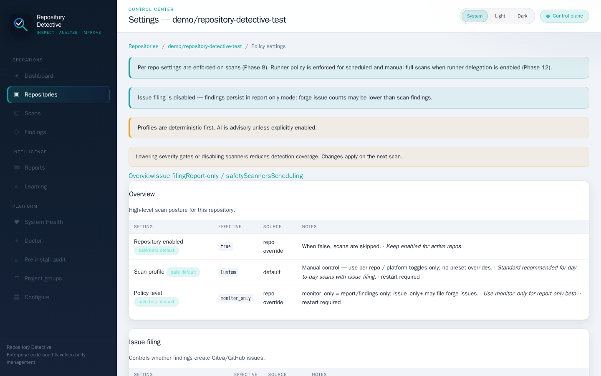

<p align="center">
  
</p>

<h1 align="center">Repository Detective</h1>

<p align="center">
  <strong>Inspect. Analyze. Improve.</strong>
</p>

<p align="center">
  Self-hosted, <strong>Gitea-first</strong> repository investigation: deterministic analysis,
  canonical finding lifecycle, owner-defined policy evaluation, and evidence-based remediation planning.
</p>

<p align="center">
  <a href="docs/release/ACCEPTANCE_v0.1.0-beta.3.md"></a>
  <a href="docs/release/ACCEPTANCE_v0.1.0-beta.3.md"></a>
  <a href="https://github.com/CommsTech/Repository-Detective/pkgs/container/repository-detective"></a>
  <a href="LICENSE"></a>
  <a href="docs/PUBLIC_BETA.md"></a>
</p>

<p align="center">
  <em>Static proof badges link to acceptance evidence — not live CI status.
  Canonical CI runs on Gitea.</em>
</p>

---

## Status (public beta)

| | |
|---|---|
| **Public Beta** | [`v0.1.0-beta.3`](docs/release/ACCEPTANCE_v0.1.0-beta.3.md) |
| **E2E tested** | Gitea **1.22.3** only ([acceptance evidence](docs/release/ACCEPTANCE_v0.1.0-beta.3.md)) |
| **Deployment** | Self-hosted Docker Compose (port **8081**) |
| **Analysis** | Deterministic-first (gitleaks, Trivy, Grype, Semgrep, …) |
| **AI** | Optional; local LLM (e.g. Ollama) supported; off by default |
| **Finding lifecycle** | Canonical Gitea issues (not one PR comment per finding) |
| **Policy** | Owner-defined Observe / Warn / Enforce |
| **Remediation** | Planning available; **remediation PR execution disabled by default** |
| **License** | [AGPL-3.0-or-later](LICENSE) |

**Who it is for:** operators who self-host Gitea and want investigation + owner-defined policy gates — not an AI code-review bot, not a vulnerability-free certification service, and not a GitHub-first product.

**Where to start:** [Quick Start](#quick-start) · [Demo](docs/DEMO.md) · [Screenshots](docs/assets/screenshots/README.md) · [Public beta guide](docs/PUBLIC_BETA.md)

---

## Quick Start

```bash
git clone https://github.com/CommsTech/Repository-Detective.git
cd Repository-Detective
cp .env.example .env
# Required: REPOSITORY_DETECTIVE_API_KEY
# For forge/webhooks: GITEA_URL, GITEA_TOKEN, WEBHOOK_SECRET
# AI stays off unless you enable it
docker compose pull && docker compose up -d
curl -s http://127.0.0.1:8081/health
# open http://127.0.0.1:8081/onboard
```

Pin the proven image (digest preferred):

```bash
export RD_IMAGE=git.commsnet.org/commstech/repository-detective:v0.1.0-beta.3
# or: ...@sha256:6a615548c8a1fc2494140e73f1c3bd3f78f0ed54a7b15eaa7a1025e83e308727
```

Verify the release: [docs/VERIFY_RELEASE.md](docs/VERIFY_RELEASE.md).  
Full walkthrough: [docs/QUICKSTART.md](docs/QUICKSTART.md) · [docs/SETUP.md](docs/SETUP.md).

---

## How it works



Optional AI is an **advisory side path**. It does not decide whether a repository is “secure.”

Text equivalent:

```text
Repository change
  → Webhook / manual scan
  → Required deterministic analyzers
  → Normalize + fingerprint evidence
  → Canonical finding / Gitea issue
  → Owner-defined policy (Observe / Warn / Enforce)
  → Re-scan / reconcile
  → Resolution evidence

Deterministic evidence  -.->  Optional AI enrichment  -.->  Explanation / plan
```

---

## What POLICY_MET means

Policy outcomes describe compliance with an **owner-configured repository policy**. They are **not** a security certification.

| Outcome | Means | Does **not** mean |
|---------|--------|-------------------|
| **POLICY_MET** | All REQUIRED evidence sources for the profile completed; no configured owner condition was violated | The repo is vulnerability-free, uncompromisable, or fully scanned for all possible issues |
| **ACTION_REQUIRED** | A configured condition was violated (e.g. severity gate) | Automatic blocking unless you chose Enforce |
| **EVALUATION_INCOMPLETE** | Required analyzer coverage failed or is incomplete | “Safe to ignore” |
| **OBSERVATION_ONLY** | Observe mode: findings recorded; Repository Detective does not enforce | No findings exist |

Details: [docs/POLICY.md](docs/POLICY.md).

---

## Privacy (accurate)

| Mode | Intent |
|------|--------|
| **LOCAL_ONLY** | Blocks external AI/notification **content** egress per policy; a local LLM (e.g. Ollama) can assist without a public AI provider |
| **HYBRID / EXTERNAL_AI** | May allow configured external AI endpoints |

If your **forge** (Gitea) is on the public internet, findings and PR summaries necessarily travel to that forge. We do **not** claim “nothing leaves the network” unless your entire topology (RD + forge + AI) is actually local.

Full model: [docs/PRIVACY_MODES.md](docs/PRIVACY_MODES.md) · [docs/PRIVACY_AND_DATA_PROTECTION.md](docs/PRIVACY_AND_DATA_PROTECTION.md).

---

## Current limitations (public beta)

- **E2E-tested forge/version:** Gitea **1.22.3** only — do not read this as “Gitea 1.22+”
- **Forgejo:** not proven
- **GitHub issue-provider path:** experimental / unproven for production
- **GitLab:** not implemented
- **Multi-user / RBAC:** not production-ready
- **Class-B remediation sandbox:** **NOT_PROVEN**; remediation PR execution **disabled by default**
- **Upgrade E2E:** **NOT_PROVEN** (`v0.1.0-beta.3` is the baseline for the next upgrade proof)

More: [docs/KNOWN_LIMITATIONS.md](docs/KNOWN_LIMITATIONS.md) · [docs/DOC_TRUTH_AUDIT.md](docs/DOC_TRUTH_AUDIT.md) · [docs/SECURITY_MODEL.md](docs/SECURITY_MODEL.md).

---

## Why GitHub shows limited history

**Gitea** is the canonical development repository.  
**GitHub** is a **sanitized public snapshot** for discovery, public issue feedback, docs, and releases.

A low commit count on GitHub does **not** represent full development history. See [docs/GITHUB_MIRROR.md](docs/GITHUB_MIRROR.md).

| Host | Role |
|------|------|
| [Gitea](https://git.commsnet.org/commstech/Repository-Detective) | Canonical — CI, wiki, day-to-day development |
| [GitHub](https://github.com/CommsTech/Repository-Detective) | Public mirror + **public feedback** |

**Report a bug:** [GitHub Issues](https://github.com/CommsTech/Repository-Detective/issues/new/choose) · **Security:** [SECURITY.md](SECURITY.md)

---

## Screenshots & demo

Synthetic disposable demo only (`demo/repository-detective-test`).

<p>
  <a href="docs/assets/screenshots/01-onboarding-connect.png"></a>
  <a href="docs/assets/screenshots/03-doctor.png"></a>
  <a href="docs/assets/screenshots/04-dashboard.png"></a>
</p>
<p>
  <a href="docs/assets/screenshots/05-finding-evidence.png"></a>
  <a href="docs/assets/screenshots/08-privacy-local-only.png"></a>
  <a href="docs/assets/screenshots/06-policy-evaluation.png"></a>
</p>

Index: [docs/assets/screenshots/README.md](docs/assets/screenshots/README.md) · Walkthrough: [docs/DEMO.md](docs/DEMO.md)  
Acceptance: [docs/release/ACCEPTANCE_v0.1.0-beta.3.md](docs/release/ACCEPTANCE_v0.1.0-beta.3.md) · Verify: [docs/VERIFY_RELEASE.md](docs/VERIFY_RELEASE.md)

---

## Design notes (short)

**Findings are canonical issues**, not PR comment spam — one lifecycle record enables dedupe, history, recurrence, evidence, FP disposition, remediation, and reopen. PRs get a **compact policy summary**. Details: [docs/FAQ_FINDINGS_AS_ISSUES.md](docs/FAQ_FINDINGS_AS_ISSUES.md).

**Naming:** product is **Repository Detective**; env prefix `REPOSITORY_DETECTIVE_*`; header `X-Repository-Detective-API-Key` — [docs/NAMING.md](docs/NAMING.md).

---

## Configuration & endpoints

| Setting | Variable |
|---------|----------|
| HTTP port | `REPOSITORY_DETECTIVE_PORT` (compose default **8081**) |
| API key (automation) | `REPOSITORY_DETECTIVE_API_KEY` |
| UI auth (new installs) | `REPOSITORY_DETECTIVE_AUTH_MODE=local` + `REPOSITORY_DETECTIVE_SESSION_SECRET` — see [AUTH_LOCAL.md](docs/AUTH_LOCAL.md) |
| Public URL | `REPOSITORY_DETECTIVE_PUBLIC_URL` |
| Gitea | `REPOSITORY_DETECTIVE_GITEA_URL`, `REPOSITORY_DETECTIVE_GITEA_TOKEN` |
| Webhook secret | `REPOSITORY_DETECTIVE_WEBHOOK_SECRET` |

| Path | Auth |
|------|------|
| `GET /health` | none |
| `GET /onboard` | none |
| `POST /webhook` | HMAC (`X-Gitea-Signature`) |
| `/api/v1/*` | API key (scripts / MCP / OpenClaw) |
| `/ui/*` | **Operator login** session when `auth_mode=local`; otherwise API key |

New installs should create the first operator at `/ui/bootstrap`, then use `/ui/login`. Keep the API key for automation — do not paste it into the operator login form. Existing `api_key_only` installs are unchanged until you opt in.

Full index: [docs/README.md](docs/README.md) · [docs/CONFIGURATION.md](docs/CONFIGURATION.md) · [docs/API_ROUTES.md](docs/API_ROUTES.md).

### Advanced install options

| Option | When |
|--------|------|
| `docker compose up -d --build` | Local source (~long build) |
| `docker-compose.minimal.yml` | Lightweight local build |
| Offline / host-network / runners | [DOCKER.md](docs/DOCKER.md) · [NETWORKING.md](docs/NETWORKING.md) · [RUNNERS.md](docs/RUNNERS.md) |

---

## License

**Community:** [AGPL-3.0-or-later](LICENSE) — [NOTICE](NOTICE) · [docs/LICENSING_STRATEGY.md](docs/LICENSING_STRATEGY.md).  
**Commercial / Enterprise:** [docs/EDITIONS.md](docs/EDITIONS.md).
