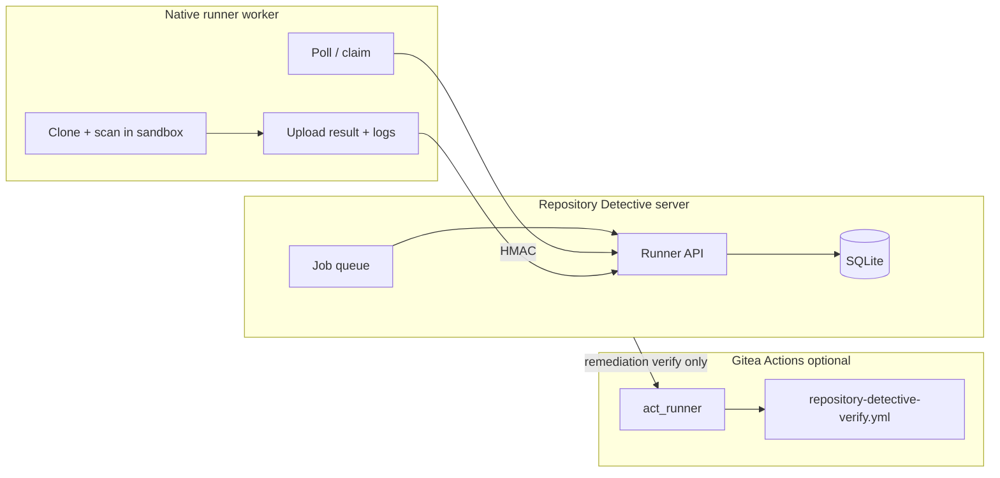

# Runner delegation architecture

Repository Detective supports **two distinct execution backends**. Do not conflate them.

## Concepts

| Backend | Purpose | Registration |
|---------|---------|--------------|
| **Native RD runner** | Scans, SBOM, graph, pre-install audits, remediation verify jobs | HMAC + `runner_shared_secret` |
| **Gitea act_runner** | Repo-native test/build workflows (optional) | Gitea registration token (secrets only) |

## Architecture



## When to use native runner

- Scheduled or manual full-repo scans (`runner_policy: auto` / `native`)
- SBOM and graph generation
- Pre-install audit compute (still report-only on core)
- Remediation verification jobs (patch validation, no PR creation on runner)

## When to use Gitea Actions

- Run the repository’s own test suite after remediation plan approval
- Optional workflow_dispatch verification via `gitea_actions_test_backend_enabled`
- **Not** used for untrusted pre-install repo execution

## Security model

- **HMAC request signing** on all runner worker endpoints when `runner_require_hmac: true`
- **Nonce replay protection** via `runner_nonce_ttl_seconds` (default 300)
- **Minimal job payload** — no forge tokens in job spec unless explicitly required
- **Log redaction** before persistence
- **Job timeout** via `runner_job_timeout_seconds`
- **Runner identity** recorded on ping/heartbeat
- **Forbidden tasks** in job spec: `issue_create`, `pull_request_create`, `dependency_install`, etc.

## Configuration

```yaml
runner_delegation_enabled: false
runner_mode: native          # native | gitea_actions | auto | core
runner_shared_secret: ""     # env / secrets only
runner_max_concurrent_jobs: 2
runner_require_hmac: true
runner_nonce_ttl_seconds: 300
runner_allowed_job_types:
  - scan
  - sbom
  - graph
  - preinstall_audit
  - remediation_verify
```

**Startup rule:** If `runner_delegation_enabled=true` and `runner_mode` is not `core`, `runner_shared_secret` must be set or startup fails.

## Job lifecycle

1. Core enqueues job (`queued`)
2. Worker `POST /api/v1/runner/ping` (heartbeat)
3. Worker `POST /api/v1/runner/jobs/claim` (HMAC)
4. Worker fetches spec, executes in isolated workspace
5. Worker `POST /api/v1/runner/jobs/:id/result` or failure
6. Core ingests findings / marks job completed or failed
7. Expired jobs marked timed out

## Why disabled by default

- Prevents unsigned runner callbacks on fresh installs
- Operators must explicitly configure shared secret and callback URL
- Reduces surprise compute on the main server until workers are provisioned

## Enable safely

1. Generate a strong `runner_shared_secret` (env var, not git)
2. Set `public_url` or `runner_callback_base_url`
3. Set `runner_mode: native`
4. Deploy one or more runner workers (container recommended)
5. Set `runner_delegation_enabled: true` and restart
6. Verify System Health → Runner job queue and Configure → Runner delegation

See also [RUNNERS.md](RUNNERS.md) (legacy operator guide) and [GITEA_ACTIONS_BACKEND.md](GITEA_ACTIONS_BACKEND.md).
