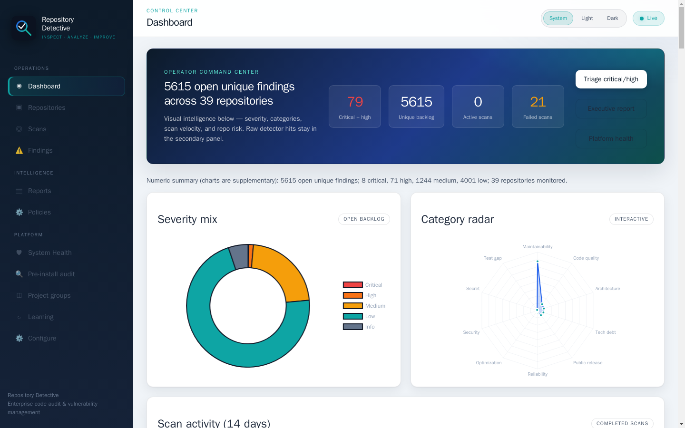
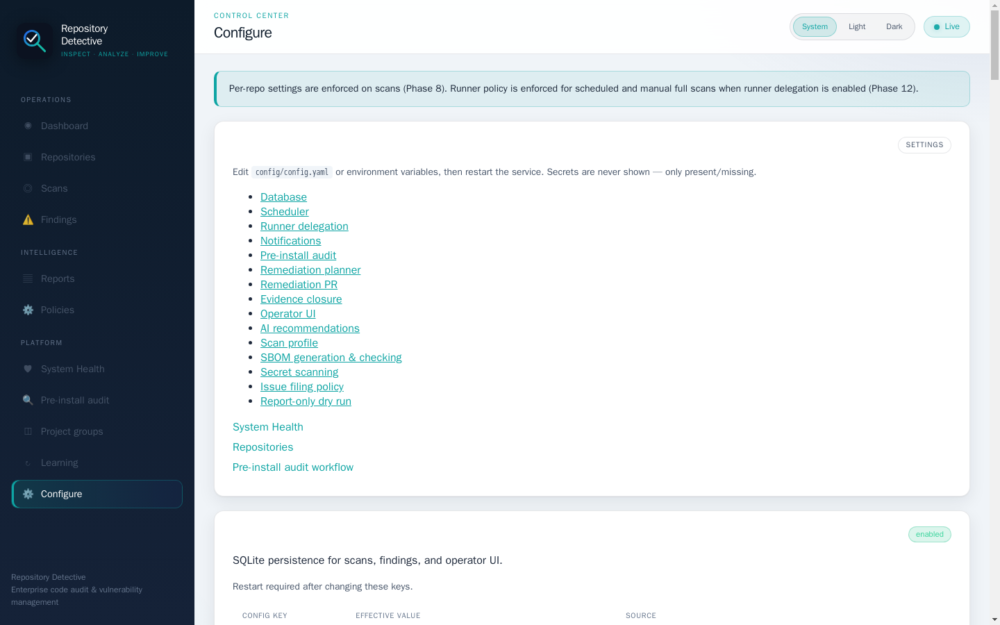
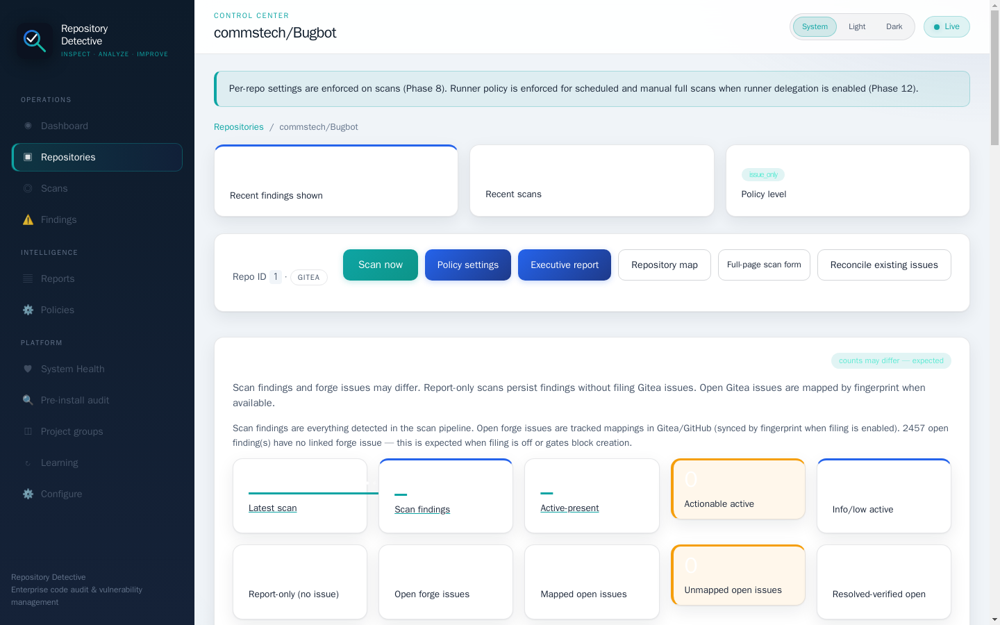

# Report-only scans

Repository Detective — Inspect. Analyze. Improve.

## Overview

This guide walks through **report-only scans** step by step for private beta testers and operators.

## Prerequisites

- Repository Detective running (see [INSTALL_STEP_BY_STEP](INSTALL_STEP_BY_STEP.md))
- Operator API key or UI session
- At least one connected repository (except pre-install audit)

## Steps

### 1. Open the operator UI

Navigate to your deployment `/ui/` (example: `http://127.0.0.1:8081/ui/`).

### 2. Follow the workflow

See the main repo docs under `docs/` for policy details. Use **Configure** for global settings and per-repo overrides on the repository detail page.

### 3. Verify results

Check scan history, reconciliation panel, and Gitea issues (when filing is enabled).

## Related

- [SECRET_SCANNING_AND_GIT_HISTORY](SECRET_SCANNING_AND_GIT_HISTORY.md)
- [ISSUE_FINDING_RECONCILIATION](ISSUE_FINDING_RECONCILIATION.md)
- Main wiki: `docs/wiki/`
